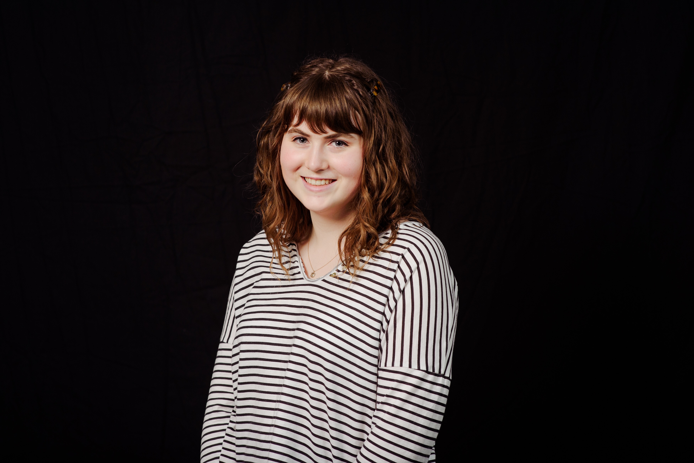

Hello, I'm Síofra Kelleher.

As a student of Business Information Systems at UCC, my interests lie in the interaction between technology and its novel application in business and society. Specifically, I hold a personal interest in connected health technologies and am an advocate for the diabetes technology community. I am a member of the International Diabetes Federation Europe, a 2021 Google Europe scholar and accessibility officer on the UCC Medical Research Technology Society committee. My interests lie not just in computer science, but also the arts(literature, art, history and writing) and public speaking. 

You can get in touch with me at <a href="mailto:kelleher.siofra@gmail.com">kelleher.siofra@gmail.com</a> or find me on [Twitter](https://twitter.com/Siofra_Kelleher) or [LinkedIn](https://www.linkedin.com/in/siofra-kelleher/).
