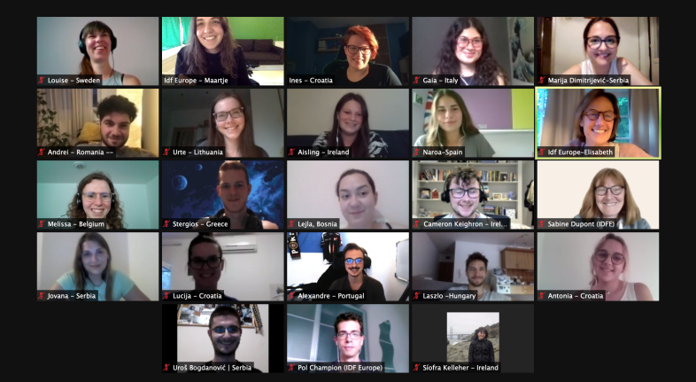

So the IDF Youth Leadership Lab is officially underway!

All new advocates have met and had a social session to get to know one another. We already have an active discord server going! We are a diverse group hailing from all across Europe.

Last week we began our first e-module in project management and heard the promoters project pitches. These included AI and diabetes, digitalisation and inequalities, and diabetes code and charter. Each advocate voted for which project they would most want to be involved with and we were placed into our respective groups.
*Luckily,* I got my first choice, AI and diabetes. I was especially interested in this project due to my own experiences using a DIY closed loop system and my background in technology. I look forward to working with the promoters, Melissa De Volder and Annie Mais, as well as my fellow advocates.
