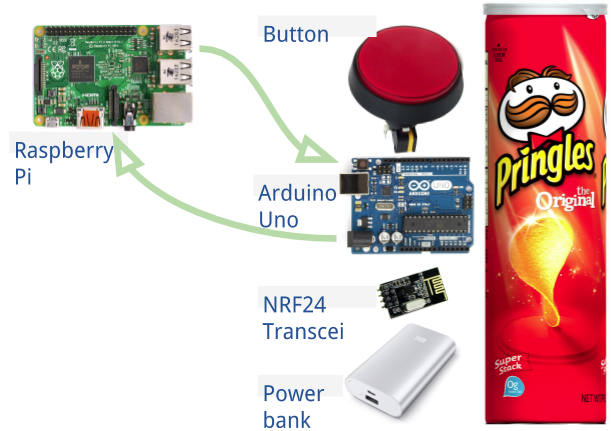
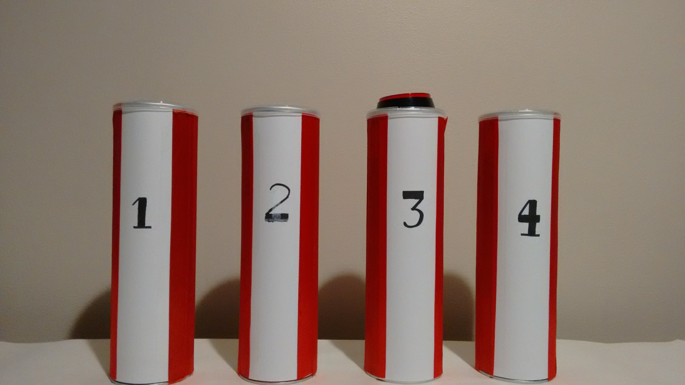

Recently I built a project called Flash Run. It consists of four cones with red buttons on top, that light up when they need to be pressed. It is an exercise game built for PE classes in Primary schools in order to encourage physical activity. There is a time limit involved, so you have to move fast! Each button you press in time earns you a point.

##How did I build it?
I built it using a number of Arduino Unos, a Raspberry Pi computer, a number NRF24L01 transceivers, a portable battery pack and a red push-button.

The Pi is connected to a HDMI display and a keyboard so I could run my code on the Raspbian operating system. Then, I connect the transceiver to an Uno with jumper wires so the Raspberry Pi and Uno could ‘talk’ and the Raspberry Pi could tell the button to light up or not. I had to use soldering to make the jumper wire connection to the button (micro-switch).

I used a portable battery pack with each Arduino so the whole set could fit into a Pringles can. I repeated this four times for four cans.

I used Python code from [Albert Hickey](https://plus.google.com/+Winkleink/ "Winkleink Google+") for the whole project but had to change a few things to make it work with my hardware.

The Arduinos were programmed to turn the button LEDs on and off when told by the Pi and for testing to see if the transceivers worked. This was all done in the Arduino IDE.
