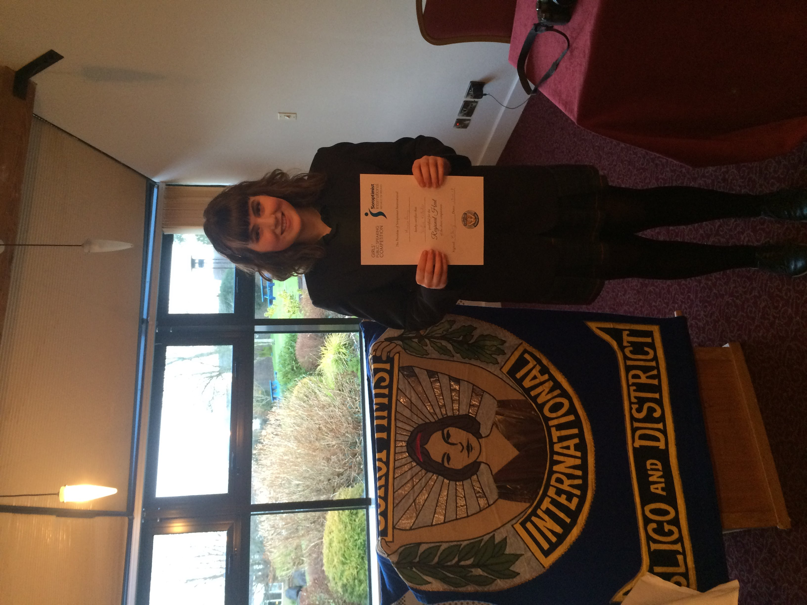

During Transition year I was encouraged by my religion teacher to enter a public speaking competition for girls, ran by Soroptimist Ireland.

I wrote a speech on whether technology will surpass human interaction and what this will do to our society. I never made past the heats, but I really enjoyed speaking. This was one of my first experiences speaking in front of an audience, and it really helped me gain confidence. So I decided to enter again in 5th year and aim to reach the regional level of the competition.

Each year, Soroptimist Ireland release several topics underneath broader headings; Human Rights, Health, Environment, Democracy, Empowerment of Women, Education and Friendship & Volunteering. These topics are usually quotes or statements. This year, I chose Friendship & Volunteering topic “Do friendships save you from the effects of bullying, or does it take more?”. As a victim of bullying, it was a deeply personal topic for me. I tried my best to have that show in my speech. I didn’t want to take an outsiders approach to the topic and shine only a positive light upon bullying.

I know that might sound very negative but I wanted to show that bullying is real, and not just what we see on television. I wanted to show that it could happen at any age, and that throughout your life you can have many different bullies. They could be classmates, coworkers, friends. There is no limit. I spoke how there is no cure-all for bullying, and that more needed to be done to stop bullying occuring.

It was a difficult topic to broach. This was obvious as no other speaker chose it. Personally, it was challenging as I had to think deeply about my own experiences and convey those feelings without turning my speech into a biography. As a victim of bullying, it’s not something you tend to share with people. I chose to share a large portion of my life with my own teacher, judges and a large audience of strangers, girls my age and their parents and teachers. In order to get across my message, I pushed myself to the edge, even tearing up during my speech. But I felt that I had to. If not for myself, then for all the other victims of bullying.

In the end I am glad that I spoke up. I’m proud that I was able to write one of my favourite speeches, and it got me through to the regional heats, which is what I was aiming for. I learned that I really love public speaking, and I want to continue speaking for a long time. I’m planning to enter again in 6th year, not to win but to spread a message!