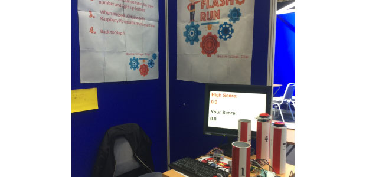

##I've got some great news for you all..
##I came second place in the Technology category at Scifest!

I entered my [Flashrun](https://siofrakelleher.com/blog/flashrun) project and to be honest, I didn't think I'd be very successful. I entered Scifest with the mindset of just trying my best and having some fun.
I was really nervous as this would be my first time talking to judges one-on-one about my project and I was scared my project wasn't going to work. Thankfully, Scifest was hosted by Sligo IT, my local college so I felt a little more at home there than in a different college.

I was terrified talking to the judges, even though I do have some experience as I competed in Soroptimist Public Speaking competition earlier this year, and even worse I had all five judges talking to me at once! I explained the project to them, how it worked and how I made it and they asked me many questions about it. Some of the questions were easy and others not so much but I felt I did pretty well overall.
Later on, you could not imagine my shock when I was announced as the second place winner! I won a certificate and a oneforall voucher as my prize.
I would highly recommend anyone to at least try to enter Scifest, it can be a real challenge but you never know what could happen!

