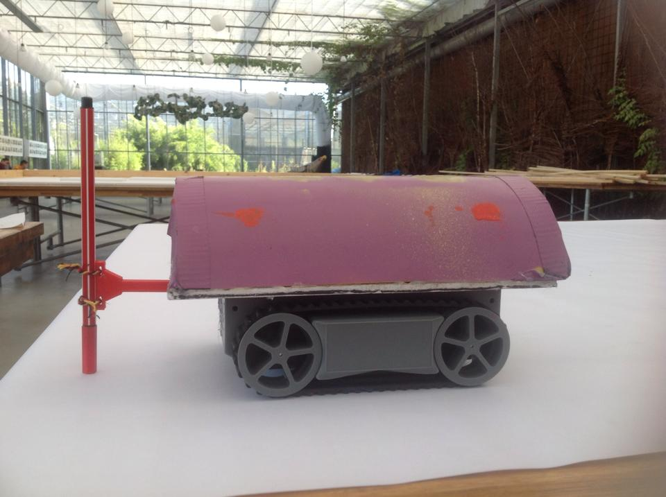

Found a photo of the robot I built at Artbot. I had so much fun making this little robot - 'the little robot that could'. The coding was the hardest part but I really enjoy assembling and testing the components. To see the display work was a real buzz. I got the hang of the coding after a bit but it was really my first time to try that kind of thing.

It was good to show the work we had done together later to a big crowd of locals and visitors. After all the hard work, it was a sort of reward to be able to showcase what we accomplished. Our 'coach' took a great video of our robot - the first to be made:

[plugin:embed](https://www.facebook.com/CentreforLifeLongLearningStAngelasCollege/videos/758900184182249)
