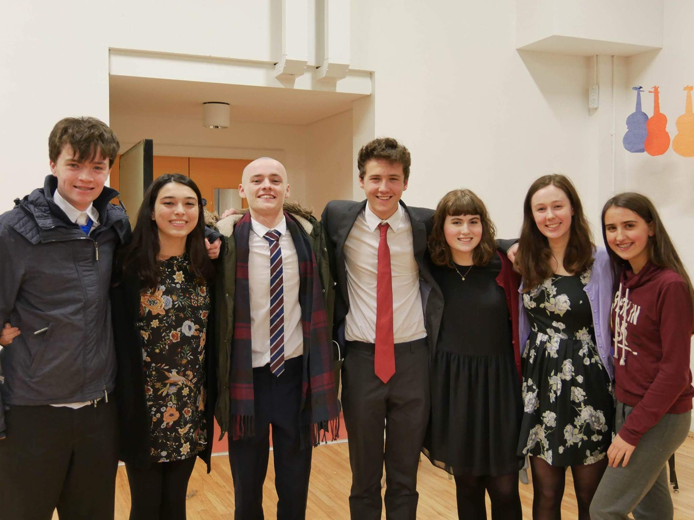
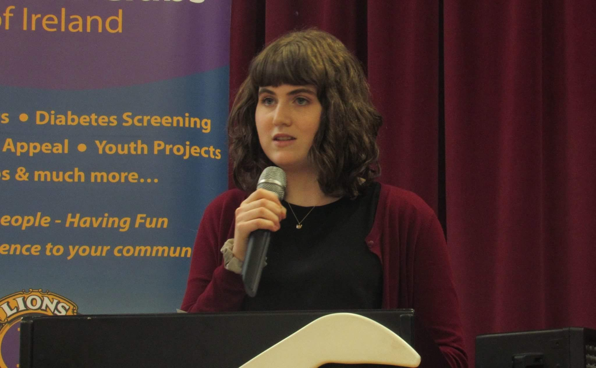

Fifth-year is a bit of humdrum, I think we can all agree. With Christmas exams around the corner, my little corner of the world was looking pretty miserable.. 

Until one fateful day when my History teacher blessed us with an application to the European Youth Parliament Connacht-Ulster Regionals. At the time, I don’t think I knew just what I was getting myself into but I can honestly say I will never forget my weekend in Galway.

[EYP Ireland](http://www.eyp.ie/ "eyp ireland") is a non-profit, non-partisan organisation that runs a number of weekend-long conferences every year for young people. The weekend consists of three days; Friday is team building (getting to know the group of people you’re about to be in a heated debate with for the next two days!), Saturday is all about research and creating a resolution for your topic. Let's just say that was definitely the toughest day and lots of coffee was needed. Sunday was the day for the general assembly, and while putting 50+ teenagers in a room with an unlimited supply of Redbull and then telling them to debate may not sound like a good idea, but it was!

So to start at the beginning, before I had even arrived in Galway, I had to research my topic. I chose to be on ITRE II, whose topic was “Establishing the Grid - In light of recent developments towards the establishment of smart energy grids throughout Europe, how should the future energy market, citizens involvement and data management look like in such a system?”. Now, I had never really heard of the smart grid before this, having only just watched a short documentary on DIY powerwalls two weeks before so I was ready for the challenge. Once I arrived at the hostel and checked in, I - with all the other delegates, took our first of many cold walks to the local secondary school to do some team building. We spent hours playing really strange games, also known as ‘energisers’, like making a 3D monster with four heads, three legs and six arms out of our bodies and finding fifty uses for a shoe! Strange doesn’t even begin to cover it! 

Saturday, we woke up at 6:45 am to be down at the school at 7:30 am. I don’t think anyone was too happy with the early start but hey, it was worth it. The whole day was dedicated to working on our resolution. A resolution consisted of a set of problems to do with our topic we conjured up and then a set of solutions to fix those problems. Not as easy as you might think, but after what has been reported to be ten hours, we did it. I think I had about five cups of coffee and a slice of pizza that day, it was such a blur. That evening, there was the ominous disco and honestly, packing that many awkward 15-18-year-olds into a school hall and playing ABBA, sounds like it wouldn’t work but it was unbelievably fun. Definitely up there as one of the best nights of my life, and that wasn’t just because of the yellow monkey teddy that was passed around or the mysterious pool noodle that appeared halfway through the night…

My favourite and also the saddest day of the weekend was Sunday. A General Assembly was held and we feverously debated everyone's resolutions, attempting to make our voices heard. We surprisingly found ourselves to be very passionate about small farms and using jazz hands suddenly became socially-acceptable again. But to give you a rundown of the General Assembly, firstly a topic was read out and then a decisive speech was heard from the topic’s committee. An attack speech from an opposing committee was heard and the debates began. Three rounds of debate with 4-5 points taken from the floor quickly descended into a frantic search for a loophole in the committee's resolution just so you could say something and be a part of the lively discussion. Nothing makes your heart beat faster than desperately trying to think of answers to debate questions when you’re the representing committee! After the debate was settled the chosen committee gave one last summation speech, which was one last emotional plea for the people to vote yes for resolution. For our topic, Smart Grid, I gave the decisive speech (which I prepared the night before at 12:30 pm!!) and I answered the debate questions from the last round. I was so nervous when it came to giving the decisive speech but I ended up sounding great. Afterwards, a girl told me that I looked really nervous walking up to the podium but once I got there it was like I deflated and I really belonged up there. It was one of the nicest compliments I’ve ever been given. In the end, we lost our resolution by 3 votes, but I couldn’t be prouder of the efforts and hard work my committee put in, no matter if we lost or won. After a teary closing ceremony, and a beautiful tin whistle rendition of the European Anthem (Irish humour never fails to disappoint) it was time for goodbyes. I had made some fantastic friends over the short three days and I hope to see them all again soon (plans for a Christmas meet up are already underway).

So, to conclude, a huge thank you to the great work of EYP, especially the organisers with us on the weekend and ITRE II fantastic chairs, Ruairi and Roza (we couldn’t have done it without you). All my friends and I could say about EYP is that we wish we could do it all over again. The memories made I will never forget, and now we have an unlimited supply of inside jokes to laugh over forever. I feel a lot more confident when speaking publicly and a lot more educated and appreciative of what the European Union does now. I would encourage everyone interested in public speaking, law, politics, interesting conversation or debate to get involved in EYP. 

*Update: I heard soon after this I heard that I got through to Regionals! Regionals will be held in Cork on the 25-28th of March*
