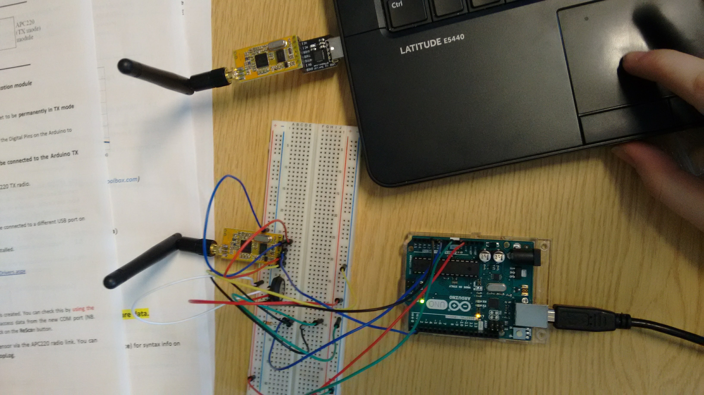
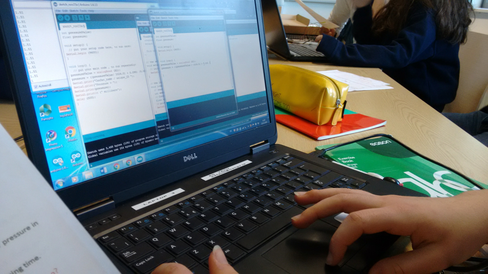

##Hello World!

I am currently in Transition year and my school will be participating in CanSat 2016/17. CanSat is a European Space Agency competition for secondary students. Students from the Northwest have not entered previously, so we are very excited to be given this amazing opportunity. There will be three teams participating and they will have to build a satellite that will be launched 0.5km into the atmosphere.

On the descent, the ‘satellite’ reads air pressure and temperature and relays this to our ground station wirelessly. This will be an exciting technical project that many of our students have never attempted before and will increase the opportunity for students to experience technology first hand. We will be getting technical support from students and lecturers from IT Sligo and will have access to their state-of-the-art labs. 

We will have 4 workshops in the IT where we will be building our satellite. The design, missions, build, launch and data collection will all be managed by us. Then at the regional finals in March we will launch our CanSat via quadcopter in front of a panel of judges. 

The winning team will move on to the Nationals where they have the chance to represent Ireland in the European competition in June 2017. This would be a great honour and so we must ask for your help. To win we have to document our journey on social media so we would love if you could like our Facebook page [Ursuline CanSat 2016/17](https://www.facebook.com/ursulinecansat/) and to encourage your family and friends to also!

Last week two of the team members, myself and my friend Eimear went to the IT Sligo for the first workshop. The aim of the workshop was to bring two students from each of the secondary schools participating in CanSat to begin building so they can become familiar with the electronics. I couldn’t wait to go because the project sounded so interesting and nothing like I had ever tried before, and who doesn’t like space?

When we got there, we were split up into teams with IT Sligo students and lecturers. We were introduced to the CanSat competition and shown how the projects are marked in the competition. We got a package of all the electronics needed and a manual that contained the instructions on how to build the satellite. There was a lot to the kit, but it included an arduino uno, sensors, radio transmitters and more! Then with our team we used the manual provided, connected the sensors and coded the Arduino Uno to make the sensors work. 

We connected an air temperature sensor, pressure sensor and radio transmitters. The radio transmitter will help the satellite send information to the computer once it is up in the air. In the package we also got a sample parachute so when we were making our own parachute we had something to model it on.

In the beginning it was hard to get to grips with all the new components and the code used. Thankfully with a bit of help from our team members, Eimear and I began to get the hang of things. So much so, that we ended up doing most of the steps ourselves! At one point the photographer for the day got us to pose for a photo and we couldn’t stop laughing! It was a really brilliant day and we can’t wait to get started on the project.

I’ll make sure to keep you posted with updates on how we are doing!

