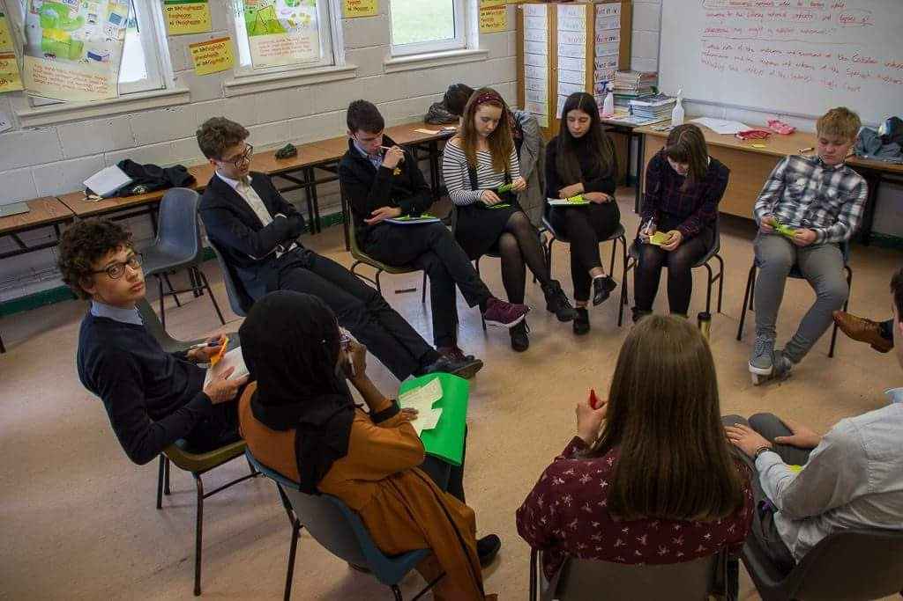
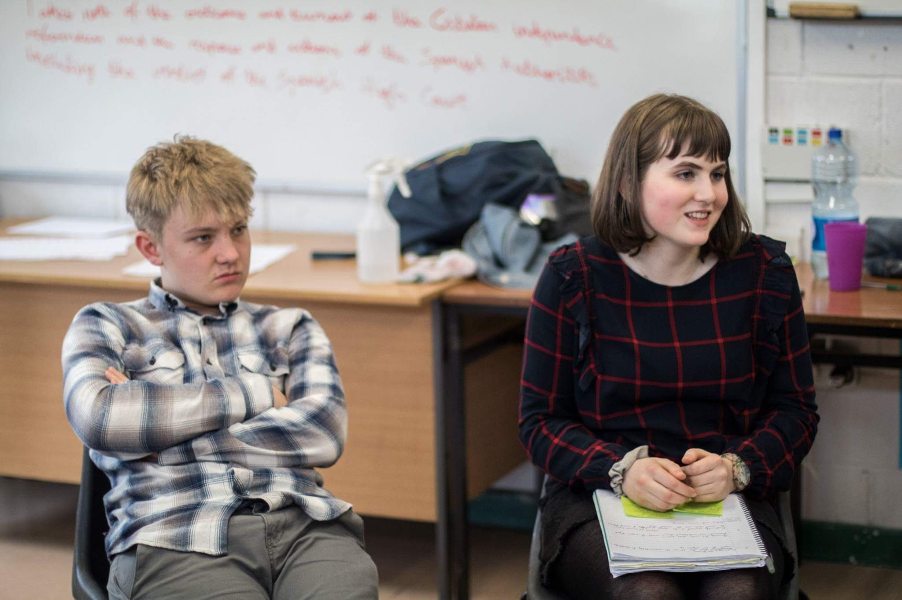

It’s often said that there are no words to describe EYP sessions and I’m afraid they’re right. In short, I’m trying to say that Nationals was a blast!

*Previously, I wrote about my experiences at the Regional EYP session. You can read about that [here](https://siofrakelleher.com/blog/eyp-reg)*

I still can’t believe my luck that I’ve gotten this far when I only had this year to participate! (EYP sessions are only open for students in 4th and 5th year) This year’s Nationals were held in Cork and despite having Cork blood in my veins, I was so nervous at the beginning of the weekend. When I got there, however, I was already recognising friends from the Connacht-Ulster Regionals and catching up after what felt like forever.

This time, my chosen topic was *‘AFCO II: In light of recent events in Catalonia, Corsica and Northern Italy, how should the EU address the current secessionist movements within its borders while accounting for the differing historical contexts and degrees of independence being sought by different movements?’* To say it was challenging was an understatement! But that is what I love about being a delegate in EYP, you never get a topic you know 100% about so you end up learning so much in very little time! If only, school was like this...

The session was four days long so I can’t possibly tell you everything that happened but I made many friends, learned a lot, had yet another experience of a lifetime and danced one of the nights away as per EYP standards!

I am immensely proud of how our committee ‘AFCO II’ worked together and put aside our differences to come to a consensus. The National Session contains delegates from all over Ireland, including walks of life, allowing a greater variety of opinion and debate. We quickly became a family of sorts, even choosing the nickname ‘secession and shenanigans’! On our committee, we had two international delegates from Poland and Switzerland, and it was really interesting to learn about their country’s EYP sessions, their cultures and lives.

This time at the general assembly I decided to dedicate my time to prepare for the debate rounds, instead of the defence speech as I had in the Regionals. Debate rounds required me to be quicker on my feet and to really stretch my knowledge and interpretation of information. I lost count how many times I spoke during the day, but my throat was sore afterwards! As per usual, the AGRI debate was fierce, lots of fun and jokes were had (including a questionable communism-themed attack speech from AFCO II) and the board quickly got sick of us delegates and our jazz hands. I may have gotten a little teary-eyed during the closing ceremony...

In conclusion, as was expected the EYP National Session was great and I wish I could relive it. Luckily for me, I’m meeting one of my new friends in Dublin soon. Without organisations like European Youth Parliament, I think Irish teens would be a lot less knowledgeable about the EU’s work and would feel a lot less connected to Europe. EYP has undoubtedly changed my life for the better and I will never regret signing up!

*Update: I found a few days later that I have been chosen as an International Delegate!! OMG! This means some time in the next year I’ll be jet-setting to another National Session in an EU member state. How amazing is that?? Stay tuned on my [twitter](https://twitter.com/Siofra_Kelleher)*