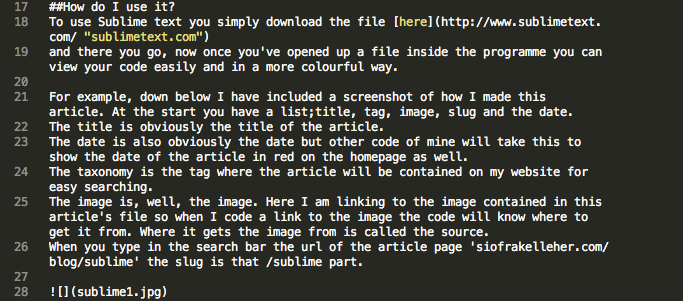

##What is Sublime?

I am going to tell you about the editor that I use for this website. I was recommended to use this editor by my Dad because it lays out the index of my website clearly and can support many languages. It is called Sublime Text and I find it very useful. I use it because code can get very messy very quickly so it is easy to lose track of it all. That's why you need to use a clever editor so you find the file you are working on easily and be able to do everything you want to do fast.

For those who don't know what an editor is, it is like your sketchpad, here you type all the code you need to edit posts, insert images and change the overall look of your website. Anything is possible. Since Grav publish my website I use the code Markdown to edit. Markdown is 'a markup language with plain text formatting syntax designed so that it can be converted to HTML and many other formats using a tool by the same name.' In case you have no idea what I just quoted I will explain it for you. A markup language is a system used to make coding easier, it allows you to code using tags that are different from the text so therefore it is easier to code. A syntax is the set of rules that define the structure of a language, such as English grammar or in this case, Markdown.

##How do I use it?
To use Sublime text you simply download the file [here](http://www.sublimetext.com/ "sublimetext.com") 
and there you go, now once you've opened up a file inside the programme you can view your code easily and in a more colourful way.

For example, down below I have included a screenshot of how I made this article. At the start you have a list;title, tag, image, slug and the date. 
The title is obviously the title of the article.
The date is also obviously the date but other code of mine will take this to show the date of the article in red on the homepage as well.
The taxonomy is the tag where the article will be contained on my website for easy searching. 
The image is, well, the image. Here I am linking to the image contained in this article's file so when I code a link to the image the code will know where to get it from. Where it gets the image from is called the source. 
When you type in the search bar the url of the article page 'siofrakelleher.com/blog/sublime' the slug is that /sublime part.

After all that, all you have to do is code whatever you want! As I said before I use Markdown which allows me to just type in English what I want to say, just like a normal text editor and then it will translate into Html without causing me any trouble. As you can see on line 17 for small headings I put two hashes in front of the heading and on line 18 for links I type what I want the link to appear as inside square brackets and the link in brackets. 
Mentioned above to include an image I type  this is a message to the computer that the image it is looking for can be located at the image url. And that's it, I hope this helps you decide whether or not to use Sublime Text as your editor and explains a little bit about Markdown and how to apply it to your projects. Just remember when coding, mistakes are inevitable and to expect and learn from them.

